# Plant Species Image Classification Using Google Teachable Machine

---

## A. Project Overview

This project presents a **Supervised Learning multi-class image classification model** designed to identify and classify **20 distinct plant species** from leaf and plant imagery. The model was developed using **Google Teachable Machine**, a web-based tool that enables the creation of machine learning models through an accessible, no-code interface.

The primary objective of this system is to automate the identification of plant species based on visual input. Given a plant image, the trained model predicts the corresponding species class with an associated confidence score. This classification system has practical applications in botanical research, biodiversity monitoring, agricultural diagnostics, and educational settings where rapid and reliable plant identification is required.

The dataset comprises a total of **5,508 images** distributed across 20 plant species classes. Each class contains between 250 and 375 labeled images, ensuring sufficient representation for model training and evaluation. The model was trained, evaluated, and tested entirely within the Google Teachable Machine platform, and subsequently exported for deployment and further analysis.

---

## B. Plant Species

The following section documents each of the 20 plant species classes used in this classification model. For every species, a representative image, the common and scientific names, and a brief academic description are provided.

---

### 1. Barberries

  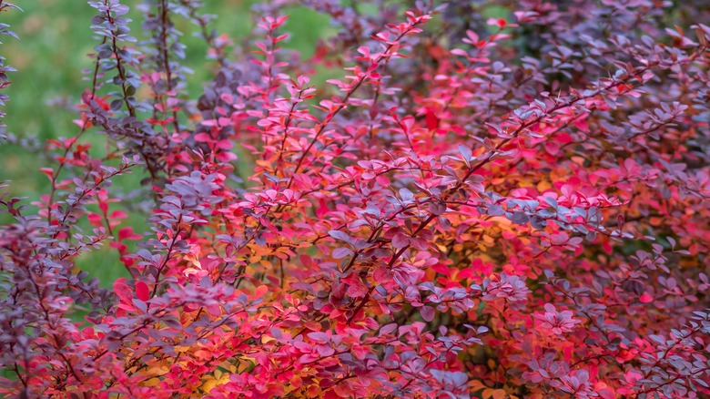

| Attribute           | Detail                |
|:-------------------:|:---------------------:|
| **Common Name**     | Barberries            |
| **Scientific Name** | *Berberis vulgaris*   |

**Description:** Barberries are deciduous or evergreen shrubs belonging to the family Berberidaceae. They are characterized by their thorny branches, oblong leaves, and clusters of small yellow flowers that develop into elongated red berries. Barberries are widely distributed across temperate and subtropical regions and are often cultivated for ornamental, culinary, and medicinal purposes.

---

### 2. Magnolia

  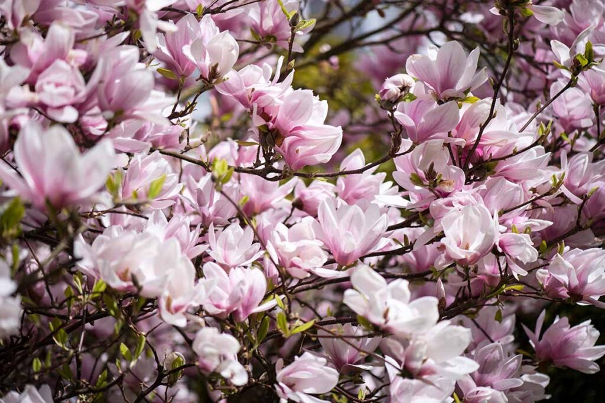

| Attribute           | Detail                 |
|:-------------------:|:----------------------:|
| **Common Name**     | Magnolia               |
| **Scientific Name** | *Magnolia grandiflora* |

**Description:** Magnolia is a genus of flowering plants in the family Magnoliaceae, recognized for their large, fragrant blossoms and broad, glossy leaves. These trees and shrubs are among the earliest known flowering plants, with fossil records dating back over 95 million years. Magnolias are commonly planted as ornamental trees in parks and gardens due to their aesthetic appeal and resilience.

---

### 3. Rubus

  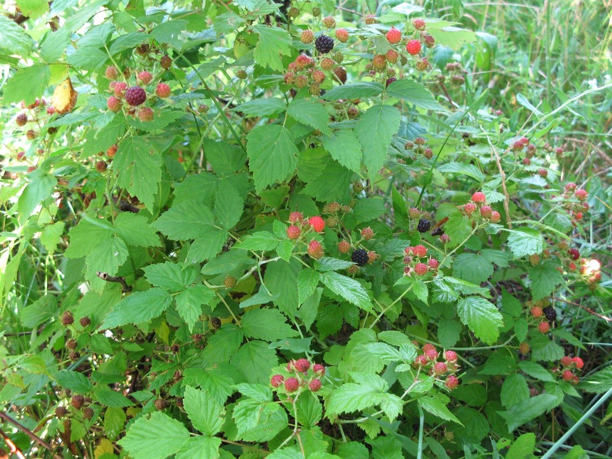

| Attribute           | Detail               |
|:-------------------:|:--------------------:|
| **Common Name**     | Rubus (Bramble)      |
| **Scientific Name** | *Rubus fruticosus*   |

**Description:** Rubus is a large and diverse genus within the family Rosaceae, encompassing species commonly known as brambles, blackberries, and raspberries. These perennial plants are typically characterized by their thorny or prickly stems, compound leaves, and aggregate fruit. Rubus species are found across a wide range of habitats and are valued both ecologically and commercially for their edible fruit.

---

### 4. Forsythia

  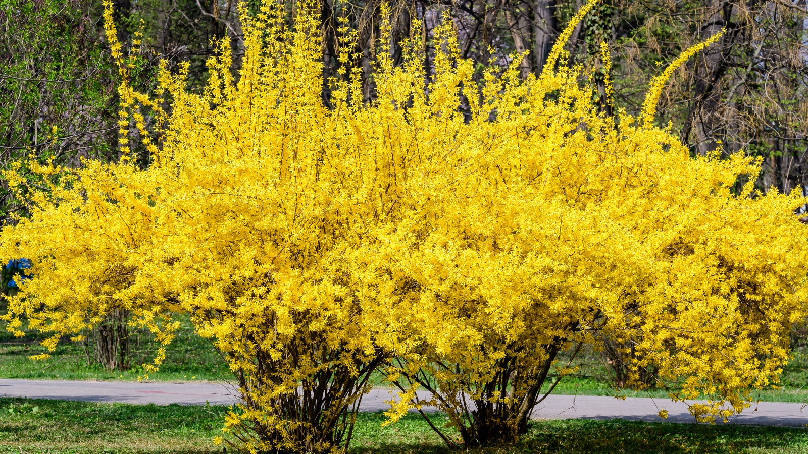

| Attribute           | Detail               |
|:-------------------:|:--------------------:|
| **Common Name**     | Forsythia            |
| **Scientific Name** | *Forsythia suspensa* |

**Description:** Forsythia is a genus of deciduous shrubs in the family Oleaceae, native to Eastern Asia and Southeastern Europe. They are among the first plants to bloom in early spring, producing bright yellow flowers along their arching branches before the emergence of leaves. Forsythia is widely used in landscape design and has a history of use in traditional medicine.

---

### 5. Weigela

  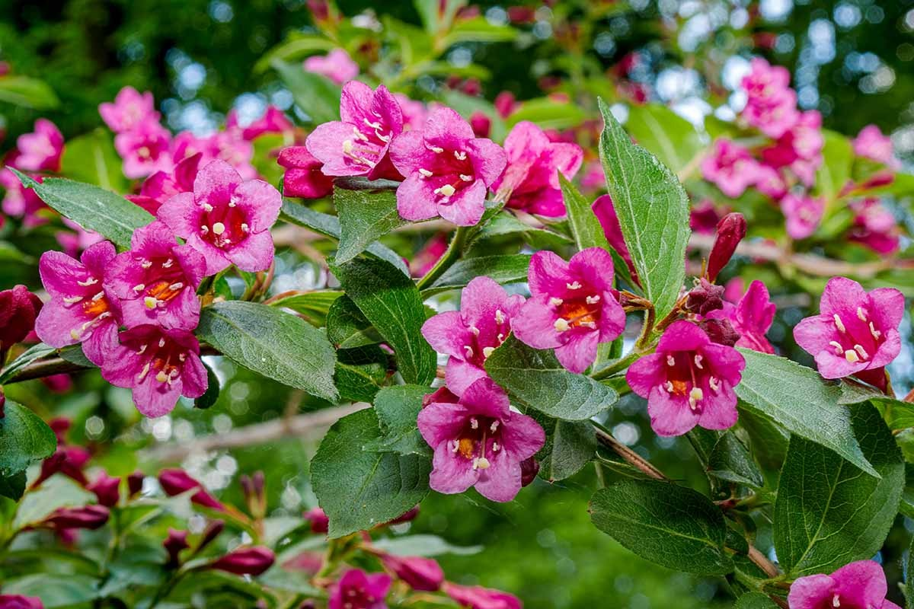

| Attribute           | Detail             |
|:-------------------:|:------------------:|
| **Common Name**     | Weigela            |
| **Scientific Name** | *Weigela florida*  |

**Description:** Weigela is a genus of deciduous shrubs in the family Caprifoliaceae, native to East Asia. The plant is best known for its profusion of funnel-shaped flowers, which range in color from white and pink to deep red. Weigela thrives in well-drained soil and full sunlight, making it a popular choice for ornamental gardening and pollinator-friendly landscapes.

---

### 6. Vaccinium

  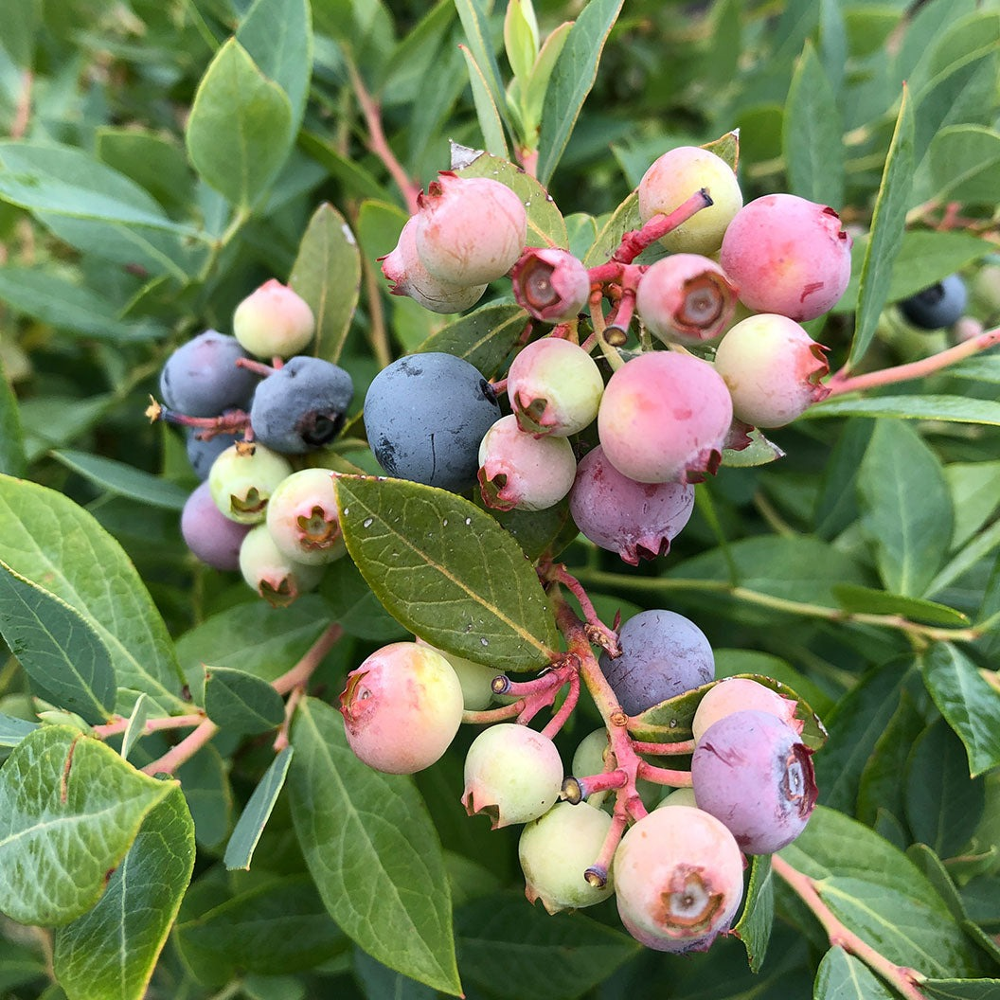

| Attribute           | Detail                              |
|:-------------------:|:-----------------------------------:|
| **Common Name**     | Vaccinium (Blueberry / Cranberry)   |
| **Scientific Name** | *Vaccinium* spp.                    |

**Description:** Vaccinium is a genus of shrubs in the heath family Ericaceae, which includes blueberries, cranberries, bilberries, and huckleberries. These plants are typically found in acidic, nutrient-poor soils and produce small, round berries rich in antioxidants. Vaccinium species hold significant economic importance in agriculture and are extensively studied for their nutritional and health-promoting properties.

---

### 7. Hibiscus Syriacus

  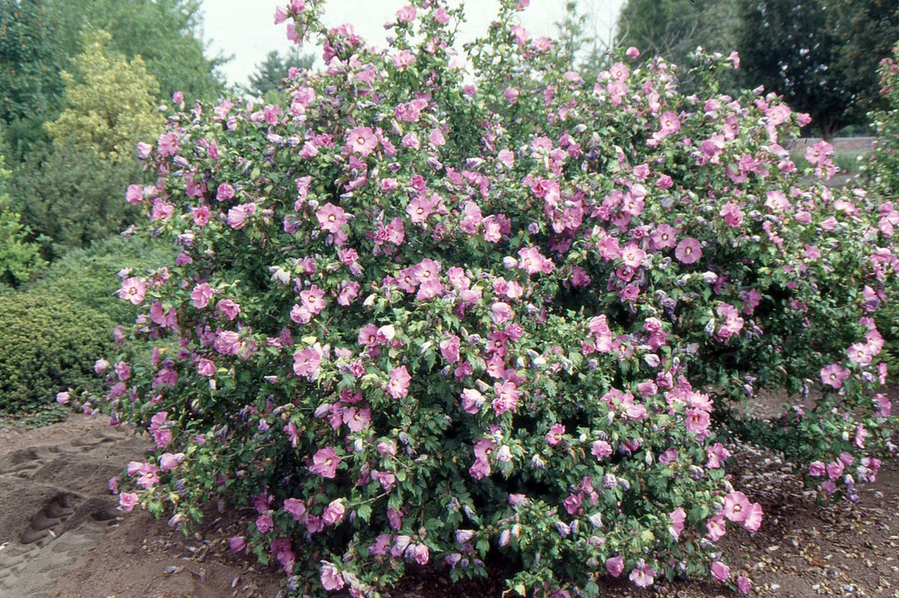

| Attribute           | Detail               |
|:-------------------:|:--------------------:|
| **Common Name**     | Rose of Sharon       |
| **Scientific Name** | *Hibiscus syriacus*  |

**Description:** Hibiscus syriacus, commonly known as Rose of Sharon, is a deciduous flowering shrub in the family Malvaceae. It is native to East Asia and is widely cultivated in temperate regions for its large, showy flowers that bloom in late summer. The plant is valued for its hardiness, drought tolerance, and its role as a late-season nectar source for pollinators.

---

### 8. Fuchsia

  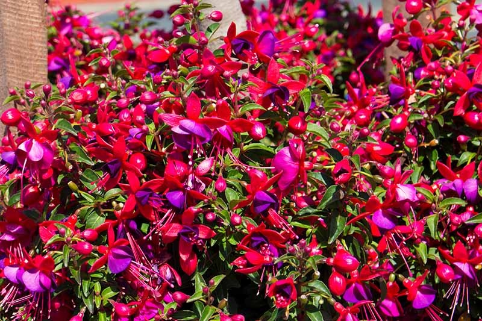

| Attribute           | Detail                  |
|:-------------------:|:-----------------------:|
| **Common Name**     | Fuchsia                 |
| **Scientific Name** | *Fuchsia magellanica*   |

**Description:** Fuchsia is a genus of flowering plants in the family Onagraceae, comprising over 100 species of shrubs and small trees. They are distinguished by their pendulous, tubular flowers with vivid combinations of red, pink, purple, and white. Fuchsia species are predominantly native to Central and South America and are widely grown as ornamental plants in gardens and hanging baskets.

---

### 9. Genista

  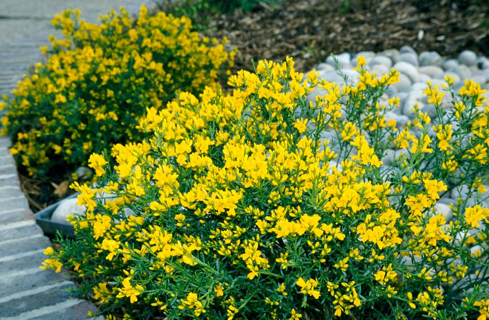

| Attribute           | Detail               |
|:-------------------:|:--------------------:|
| **Common Name**     | Genista (Broom)      |
| **Scientific Name** | *Genista tinctoria*  |

**Description:** Genista is a genus of leguminous shrubs in the family Fabaceae, commonly referred to as brooms. These plants produce dense clusters of bright yellow, pea-like flowers and are adapted to dry, nutrient-poor soils. Genista species play an important ecological role in nitrogen fixation and soil stabilization, and several species have historical significance as sources of natural dyes.

---

### 10. Aronia Melanocarpa

  

| Attribute           | Detail                |
|:-------------------:|:---------------------:|
| **Common Name**     | Black Chokeberry      |
| **Scientific Name** | *Aronia melanocarpa*  |

**Description:** Aronia melanocarpa, commonly known as black chokeberry, is a deciduous shrub in the family Rosaceae native to eastern North America. It produces clusters of small white flowers followed by dark purple-black berries that are notably high in anthocyanins and antioxidants. The plant has gained attention in recent years as a functional food crop and is also utilized in landscaping for its attractive fall foliage.

---

### 11. Itea

  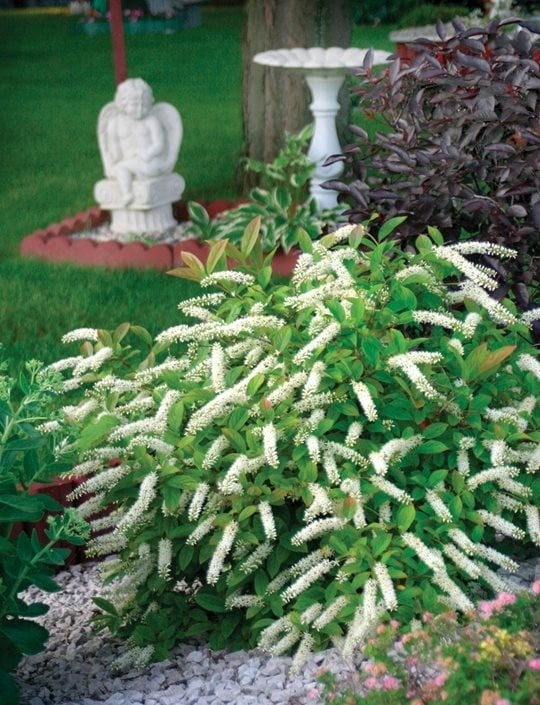

| Attribute           | Detail             |
|:-------------------:|:------------------:|
| **Common Name**     | Itea (Sweetspire)  |
| **Scientific Name** | *Itea virginica*   |

**Description:** Itea is a genus of shrubs and small trees in the family Iteaceae. The most commonly cultivated species, Itea virginica (Virginia sweetspire), is native to the eastern United States and is recognized for its fragrant, drooping racemes of white flowers and its vibrant red-purple autumn foliage. Itea species are valued in landscape architecture for their adaptability to wet soils and shaded environments.

---

### 12. Actinidia

  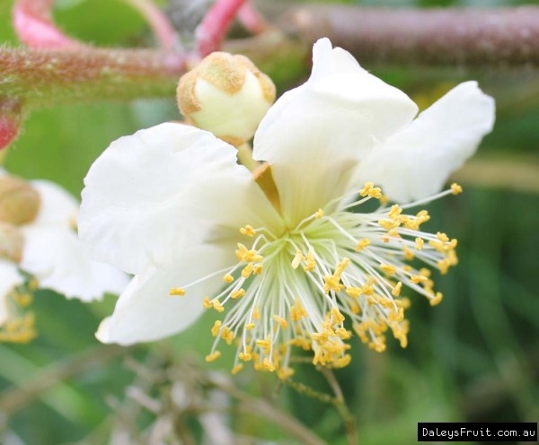

| Attribute           | Detail                     |
|:-------------------:|:--------------------------:|
| **Common Name**     | Actinidia (Kiwifruit vine) |
| **Scientific Name** | *Actinidia deliciosa*      |

**Description:** Actinidia is a genus of woody, climbing vines in the family Actinidiaceae, most widely known for Actinidia deliciosa, the source of the common kiwifruit. The plants are native to East Asia and are characterized by their large, heart-shaped leaves and small, fragrant flowers. Actinidia species are of significant commercial value in the global fruit industry and are also studied for their phytochemical properties.

---

### 13. Pistacia

  

| Attribute           | Detail               |
|:-------------------:|:--------------------:|
| **Common Name**     | Pistacia (Pistachio) |
| **Scientific Name** | *Pistacia vera*      |

**Description:** Pistacia is a genus of trees and shrubs in the family Anacardiaceae, native to Central Asia and the Mediterranean region. The genus includes Pistacia vera, the commercially important pistachio nut tree, as well as several species used for resin production and as rootstocks. Pistacia species are drought-tolerant and adapted to arid and semi-arid climates, making them ecologically and economically significant in their native range.

---

### 14. Abelia

  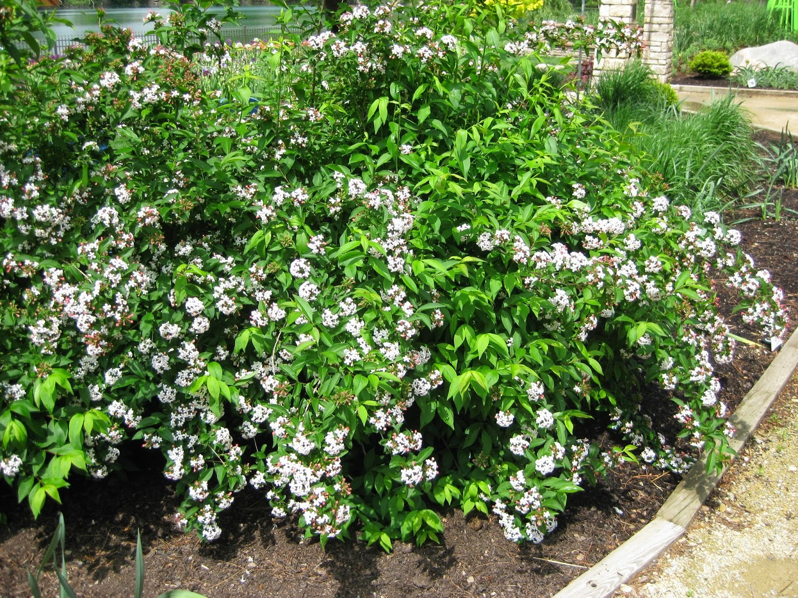

| Attribute           | Detail                  |
|:-------------------:|:-----------------------:|
| **Common Name**     | Abelia                  |
| **Scientific Name** | *Abelia x grandiflora*  |

**Description:** Abelia is a genus of flowering shrubs in the family Linnaeaceae, widely cultivated as ornamental plants in temperate and subtropical gardens. The most commonly grown species, Abelia x grandiflora, produces clusters of small, tubular, fragrant flowers that bloom from late spring through autumn. Abelia is prized for its extended flowering season, semi-evergreen foliage, and its ability to attract butterflies and hummingbirds.

---

### 15. Hedera

  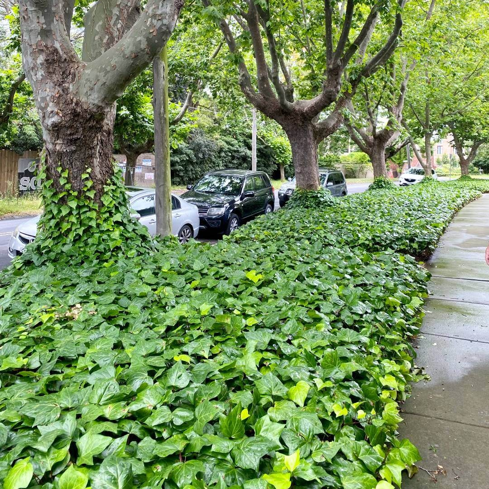

| Attribute           | Detail          |
|:-------------------:|:---------------:|
| **Common Name**     | Hedera (Ivy)    |
| **Scientific Name** | *Hedera helix*  |

**Description:** Hedera is a genus of evergreen climbing or ground-creeping woody plants in the family Araliaceae. Hedera helix, commonly known as English ivy, is the most widely recognized species and is notable for its distinctive lobed leaves and its ability to adhere to vertical surfaces using aerial rootlets. While widely used in landscaping and as ground cover, Hedera species can become invasive in certain ecosystems and require careful management.

---

### 16. Calluna

  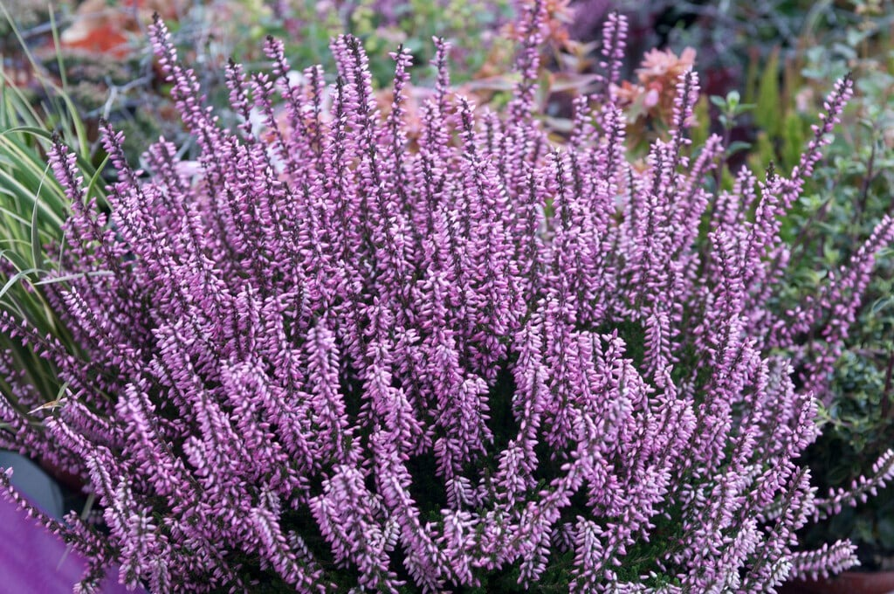

| Attribute           | Detail              |
|:-------------------:|:-------------------:|
| **Common Name**     | Calluna (Heather)   |
| **Scientific Name** | *Calluna vulgaris*  |

**Description:** Calluna vulgaris, commonly known as heather or ling, is the sole species in the genus Calluna within the family Ericaceae. It is an evergreen, low-growing shrub native to Europe, Asia Minor, and North Africa, typically found in acidic heathlands, moorlands, and bogs. Calluna is ecologically important as a dominant species in heathland habitats and is also cultivated commercially for its ornamental value and its role in honey production.

---

### 17. Ephedra

  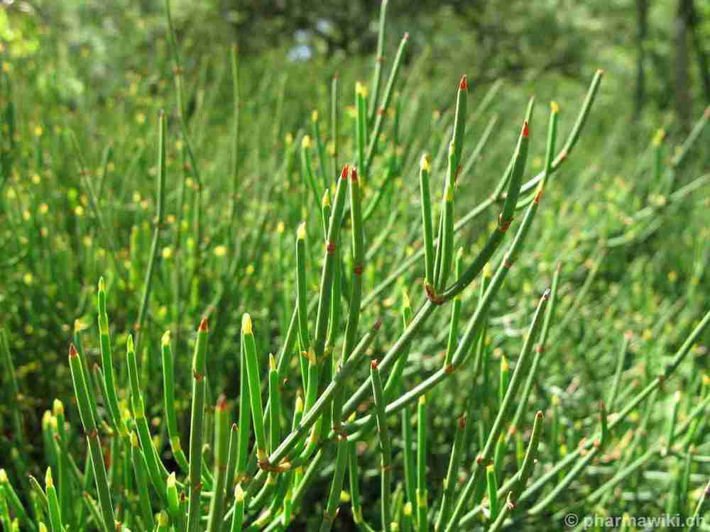

| Attribute           | Detail               |
|:-------------------:|:--------------------:|
| **Common Name**     | Ephedra (Joint Fir)  |
| **Scientific Name** | *Ephedra sinica*     |

**Description:** Ephedra is a genus of gymnosperm shrubs in the family Ephedraceae, distributed across arid and semi-arid regions worldwide. The plants are characterized by their jointed, photosynthetic stems, scale-like leaves, and cone-like reproductive structures. Ephedra has a long history of use in traditional medicine, particularly in East Asia, where extracts from Ephedra sinica (ma huang) have been used for their bronchodilatory and stimulant properties.

---

### 18. Lapageria

  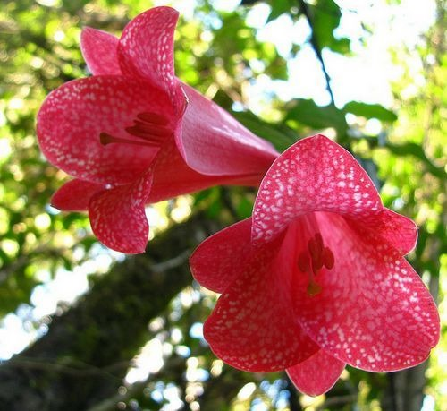

| Attribute           | Detail                         |
|:-------------------:|:------------------------------:|
| **Common Name**     | Lapageria (Chilean Bellflower) |
| **Scientific Name** | *Lapageria rosea*              |

**Description:** Lapageria rosea is the sole species in the genus Lapageria, belonging to the family Philesiaceae. It is the national flower of Chile and is a climbing plant renowned for its large, waxy, bell-shaped flowers that are typically deep pink to crimson in color. Lapageria is native to the temperate rainforests of southern Chile and Argentina and is cultivated as a prized ornamental in suitably mild and humid climates.

---

### 19. Pieris

  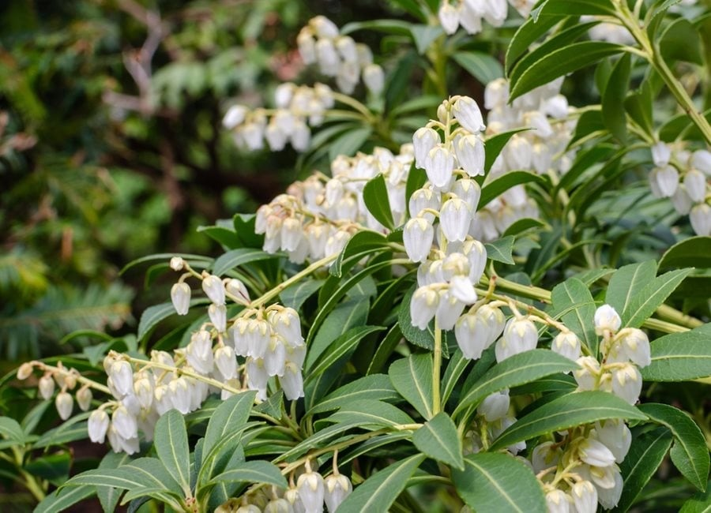

| Attribute           | Detail              |
|:-------------------:|:-------------------:|
| **Common Name**     | Pieris (Andromeda)  |
| **Scientific Name** | *Pieris japonica*   |

**Description:** Pieris is a genus of evergreen shrubs in the family Ericaceae, native to eastern and southern Asia and eastern North America. Pieris japonica is the most commonly cultivated species, admired for its cascading clusters of bell-shaped white or pink flowers and its colorful new foliage, which emerges in shades of red and bronze. The genus thrives in acidic, well-drained soils and is a staple in woodland and shade garden plantings.

---

### 20. Callistemon

  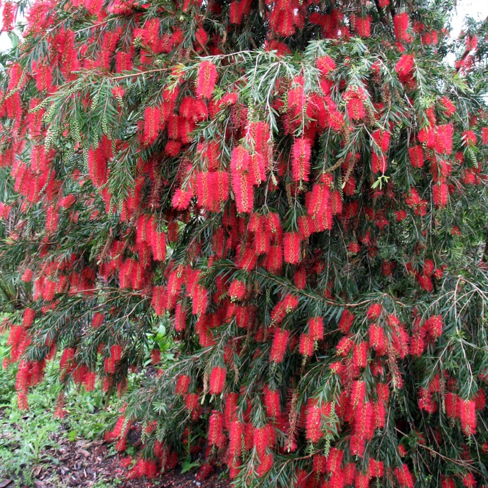

| Attribute           | Detail                    |
|:-------------------:|:-------------------------:|
| **Common Name**     | Callistemon (Bottlebrush) |
| **Scientific Name** | *Callistemon citrinus*    |

**Description:** Callistemon is a genus of shrubs and small trees in the family Myrtaceae, native to Australia. The genus derives its common name, bottlebrush, from its distinctive cylindrical flower spikes composed of numerous stamens, typically vivid red in color. Callistemon species are drought-tolerant, attract nectar-feeding birds and insects, and are widely planted in warm-climate regions as ornamental and street trees.

---

## C. Model Training Details

The classification model was trained using **Google Teachable Machine**, a browser-based machine learning platform developed by Google. The training process involved uploading labeled image datasets for each of the 20 plant species classes and configuring the model's hyperparameters prior to training.

### Training Hyperparameters

| Parameter           | Value   |
|:-------------------:|:-------:|
| **Epochs**          | 100     |
| **Batch Size**      | 32      |
| **Learning Rate**   | 0.001   |

### Explanation to the Tranining Hyperparamaters

The model was trained for 100 epochs to allow sufficient learning iterations over the entire dataset. By increasing the number of epochs, I ensured that the model had enough opportunities to extract and refine distinguishing visual features among the 20 plant species. During training, the accuracy curve showed stable convergence before reaching 100 epochs, but I retained the full 100 epochs to maintain consistency and ensure that the model achieved optimal performance without premature stopping.

I selected a batch size of 32 to balance training efficiency and stability. A batch size of 32 allows the model to process a manageable number of images per weight update, which helps maintain stable gradient updates while avoiding excessive memory consumption. This size is commonly used in image classification tasks because it provides an effective compromise between computational efficiency and model convergence behavior.

The learning rate of 0.001 was chosen to ensure stable optimization during training. A value of 0.001 prevents large weight updates that could destabilize the model while still allowing the network to converge at an efficient rate. This learning rate is widely used in supervised image classification tasks and is considered a reliable default for achieving smooth and consistent convergence.

### Dataset Distribution

The dataset used for training consists of a total of **5,508 images** distributed across 20 classes. The table below presents the number of images per class.

| No. | Plant Species         | Number of Images |
|:---:|:----------------------|:----------------:|
| 1   | Barberries            | 256              |
| 2   | Magnolia              | 250              |
| 3   | Rubus                 | 275              |
| 4   | Forsythia             | 277              |
| 5   | Weigela               | 309              |
| 6   | Vaccinium             | 358              |
| 7   | Hibiscus Syriacus     | 375              |
| 8   | Fuchsia               | 259              |
| 9   | Genista               | 251              |
| 10  | Aronia Melanocarpa    | 284              |
| 11  | Itea                  | 257              |
| 12  | Actinidia             | 250              |
| 13  | Pistacia              | 302              |
| 14  | Abelia                | 250              |
| 15  | Hedera                | 263              |
| 16  | Calluna               | 266              |
| 17  | Ephedra               | 250              |
| 18  | Lapageria             | 250              |
| 19  | Pieris                | 287              |
| 20  | Callistemon           | 291              |
|     | **Total**             | **5,508**        |

---

## D. Model Evaluation

I evaluated the trained model to assess its classification performance across all 20 plant species classes. I intended to generate standard evaluation metrics using the built-in analysis tools available in Google Teachable Machine's "Under the Hood" section. However, due to a platform-side runtime error, certain evaluation outputs could not be produced. The sections below document both the available and unavailable metrics accordingly.

### Confusion Matrix

The confusion matrix is a standard evaluation tool in multi-class classification that provides a tabular summary of predicted versus actual class labels. In a confusion matrix, each row represents instances of an actual class, while each column represents instances of a predicted class. Values along the diagonal indicate correct classifications, whereas off-diagonal values indicate misclassifications between specific class pairs. This metric is particularly useful for identifying systematic prediction errors and for understanding inter-class confusion patterns within the model.

> **Note:** The confusion matrix for this model could not be generated due to a persistent runtime error encountered within Google Teachable Machine's evaluation module. Specifically, the platform's "Under the Hood" feature produces the following JavaScript exception during execution:
>
> `Uncaught (in promise) TypeError: t is not a function`
>
> This is an internal platform error that is outside the scope of user-configurable parameters and has been observed across multiple sessions. As this is a known limitation of the Teachable Machine environment, the confusion matrix visualization is not available for this project at this time.

### Accuracy Per Class

Accuracy per class is a metric that measures the proportion of correctly classified instances for each individual class in a multi-class classification task. It provides granular insight into how effectively the model distinguishes each plant species, and is instrumental in identifying classes that may benefit from additional training data, improved image quality, or data augmentation. Variations in per-class accuracy are commonly attributed to factors such as visual similarity between species, class imbalance, and inconsistencies in image resolution or background composition.

> **Note:** Similar to the confusion matrix, the per-class accuracy visualization could not be generated due to the same Teachable Machine runtime error (`TypeError: t is not a function`) encountered in the platform's evaluation module. This limitation is attributable to the platform infrastructure and does not reflect on the model's training integrity.

### Overall Model Accuracy

#### Training Accuracy

  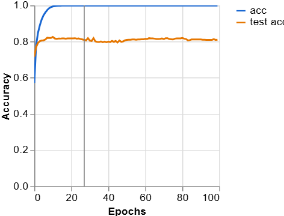

#### Training Loss

  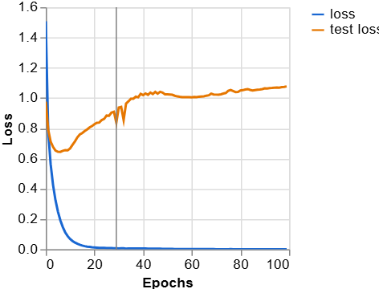

The training and validation performance of the model are illustrated in the loss and accuracy curves above. During training, the model's accuracy rapidly increased and converged near 100%, while the training loss decreased close to zero. This indicates that the model successfully learned the distinguishing visual features of the 20 plant species within the training dataset.

In contrast, the test accuracy stabilized at approximately 80–82%, while the test loss fluctuated around 1.0. The observed gap between training and test performance suggests a degree of overfitting, where the model performs exceptionally well on training data but slightly less effectively on unseen validation data. However, the validation accuracy remained stable across epochs, indicating that the model maintained consistent generalization performance despite minor overfitting behavior.

Overall, the model demonstrates strong classification capability with stable convergence, achieving high training accuracy and satisfactory test accuracy across all classes.

---

## E. Model Testing

To validate the model's generalization capability and real-world prediction accuracy, I conducted a series of 10 independent test cases. For each test case, I provided the model with a previously unseen plant image and recorded the resulting classification output, including the predicted species class and its corresponding confidence percentage. These test cases serve as empirical evidence of the model's inference performance beyond the training and validation datasets.

---

### Test Case 1

**Input Image:**

  

**Model Prediction:**

  

---

### Test Case 2

**Input Image:**

  

**Model Prediction:**

  

---

### Test Case 3

**Input Image:**

  

**Model Prediction:**

  

---

### Test Case 4

**Input Image:**

  

**Model Prediction:**

  

---

### Test Case 5

**Input Image:**

  

**Model Prediction:**

  

---

### Test Case 6

**Input Image:**

  

**Model Prediction:**

  

---

### Test Case 7

**Input Image:**

  

**Model Prediction:**

  

---

### Test Case 8

**Input Image:**

  

**Model Prediction:**

  

---

### Test Case 9

**Input Image:**

  

**Model Prediction:**

  

---

### Test Case 10

**Input Image:**

  

---

## F. Exported Model

The trained model was exported from Google Teachable Machine and is available in this repository.

| Resource                     | Link                                              |
|:-----------------------------|:--------------------------------------------------|
| **Keras Model (.h5 file)**   | [Download keras_model.h5](model/keras_model.h5)   |
| **Additional Model Files**   | [View model folder](model/)                       |

---

## G. Reflection Answers

**1. How did the number of images per class affect your model's accuracy?**

Based on my experience during training, the number of images per class had a direct impact on the model's classification performance. I observed that plant species with a larger number of images, particularly those exceeding 300 samples, generally achieved more stable and confident predictions. A higher number of images provided greater variation in angles, lighting conditions, background composition, and plant growth stages, which allowed the model to learn more robust feature representations. In contrast, classes with fewer images exhibited slightly less consistent prediction confidence. Overall, a more balanced and sufficiently large dataset per class contributed to improved generalization and classification stability.

---

**2. Which plant species were most commonly misclassified and why?**

In my testing observations, one notable misclassification occurred between Aronia melanocarpa and Vaccinium. In a specific test case, the correct class of the uploaded sample image was Aronia melanocarpa; however, the model predicted it as Vaccinium with higher confidence. I believe this occurred due to the strong visual similarity between the two species, particularly in terms of leaf structure, berry-like fruit appearance, and overall foliage coloration.

Both species share overlapping morphological characteristics, especially in images where distinguishing features such as fruit detail, leaf texture, or growth pattern are not clearly emphasized. As a result, the model likely focused on dominant visual cues common to both classes rather than subtle differentiating features. This instance demonstrates how inter-class similarity can influence prediction confidence in multi-class image classification tasks, particularly when species belong to closely related botanical groups.

---

**3. How did changing the epochs, batch size, or learning rate affect the training results?**

Adjusting the training parameters significantly influenced the model's convergence behavior and overall performance. When the number of epochs was too low, the model did not fully converge, resulting in lower accuracy. Increasing the epochs to 100 allowed the training process to stabilize, as indicated by the plateau observed in the accuracy curve. The batch size of 32 provided a balanced approach between computational efficiency and gradient stability, preventing excessive fluctuations during weight updates. Additionally, a learning rate of 0.001 ensured steady convergence without overshooting the optimal solution. Overall, selecting appropriate hyperparameters contributed to smooth training dynamics and consistent performance improvements.

---

**4. What challenges did you encounter during dataset collection and labeling?**

One of the primary challenges I encountered was collecting a sufficiently diverse and high-quality dataset for each plant species. It was particularly difficult to source images without watermarks and with consistent resolution. Another challenge involved avoiding duplicate or near-duplicate images, as repeated patterns could introduce bias and negatively affect model generalization. Additionally, careful labeling was essential, especially for visually similar species, to prevent misclassification during training. Ensuring dataset consistency while maintaining diversity required significant attention during the data preparation phase.

---

**5. If you were to improve your model, what specific changes would you make and why?**

If I were to further improve the model, I would prioritize increasing dataset diversity, particularly for species that exhibit visual similarities. Expanding the dataset with additional images captured under varied environmental conditions would enhance the model's generalization capability. I would also apply more extensive data augmentation techniques, such as rotation, scaling, and brightness adjustments, to simulate real-world variations. Furthermore, I would evaluate the model using external validation tools to obtain additional performance metrics such as precision, recall, and F1-score. These improvements would provide a more comprehensive understanding of class-level performance and further strengthen the robustness of the classification system.

---

## H. Repository Contents

The following is a summary of the files and directories contained within this repository.

| File / Directory     | Description                                                              |
|:---------------------|:-------------------------------------------------------------------------|
| `README.md`          | Project documentation and overview (this file)                           |
| `model/`             | Exported Teachable Machine model files (model.json, weights, metadata)   |
| `assets/plants/`     | Representative images for each of the 20 plant species classes           |
| `assets/evaluation/` | Model evaluation visualizations (confusion matrix, accuracy charts)      |
| `assets/testing/`    | Test case input images and prediction output screenshots                 |
| `screenshots/`       | Additional screenshots of the training process and dataset configuration |

---

  <em>This project was developed as part of our coursework requirement CSC120. The classification model was built and trained using <a href="https://teachablemachine.withgoogle.com/">Google Teachable Machine</a>.</em>

